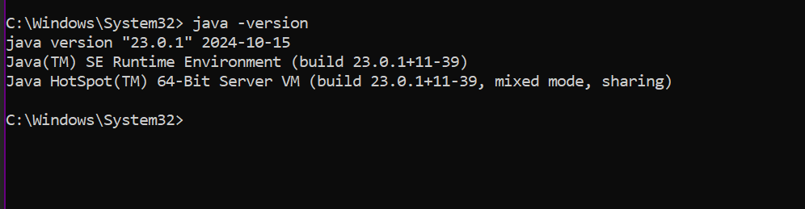
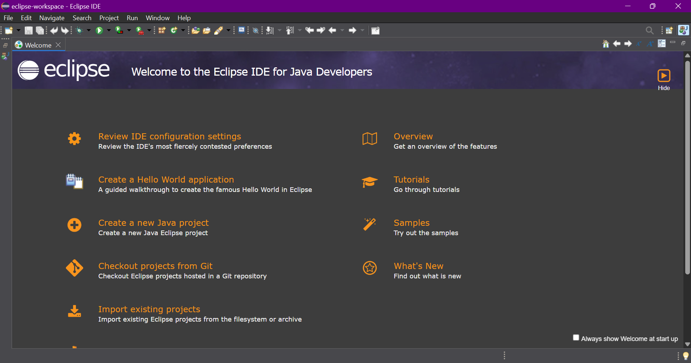
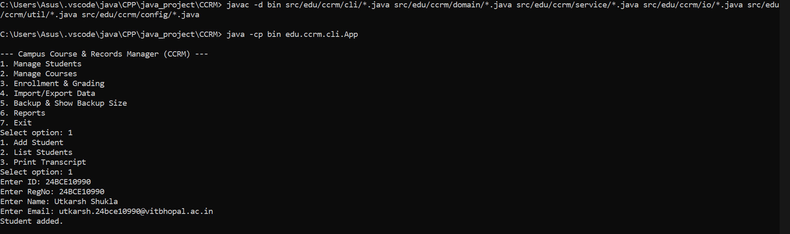

# Campus Course & Records Manager (CCRM)

## Project Overview
CCRM is a console-based Java SE application for managing students, courses, enrollments, grades, transcripts, and file operations for an educational institute. It demonstrates OOP principles, modern Java features, robust exception handling, and design patterns.

## How to Run
- **JDK Version:** Java SE 17+
- **Compile:**
	```
	javac -d bin src/edu/ccrm/cli/*.java src/edu/ccrm/domain/*.java src/edu/ccrm/service/*.java src/edu/ccrm/io/*.java src/edu/ccrm/util/*.java src/edu/ccrm/config/*.java
	```
- **Run:**
	```
	java -cp bin edu.ccrm.cli.App
	```

## Evolution of Java (Timeline)
- 1995: Java 1.0 released
- 1998: Java 2 (J2SE, J2EE, J2ME)
- 2004: Java 5 (Generics, Enums)
- 2014: Java 8 (Lambdas, Streams)
- 2017: Java 9+ (Modules, JShell)
- 2021: Java 17 (LTS)

##Comparisons between Java ME,SE,EE
| Feature         | Java ME           | Java SE           | Java EE           |
|----------------|-------------------|-------------------|-------------------|
| Target         | Mobile/Embedded   | Desktop/Server    | Enterprise/Web    |
| APIs           | Limited           | Full Core         | Web/Enterprise    |
| Use Case       | IoT, Mobile       | Apps, Tools       | Web, Services     |

## Java Architecture
- **JDK:** Java Development Kit (tools + JRE)
- **JRE:** Java Runtime Environment (JVM + libraries)
- **JVM:** Java Virtual Machine (executes bytecode)
- **Interaction:** Source code → JDK compiles → JVM runs via JRE

## Install & Configure Java on Windows
1. Download JDK from [Oracle](https://www.oracle.com/java/technologies/downloads/)
2. Install and set JAVA_HOME
3. Add to PATH
4. Verify:
	 ```
	 java -version
	 ```
	 

## Using Eclipse IDE
1. Create new Java project
2. Add source folders and packages
3. Set run configuration to `edu.ccrm.cli.App`
4. Run project
	 


## Menu Example & Screenshot

Below is the main menu displayed when you run the CCRM application:

```
--- Campus Course & Records Manager (CCRM) ---
1. Manage Students
2. Manage Courses
3. Enrollment & Grading
4. Import/Export Data
5. Backup & Show Backup Size
6. Reports
7. Exit
Select option: 1
```



After selecting an option, you will be guided through further sub-menus and actions (see sample workflow below).

## Syllabus Mapping Table
| Topic                        | File/Class/Method                  |
|------------------------------|------------------------------------|
| Encapsulation                | domain/Person.java, Student.java   |
| Inheritance                  | domain/Person.java, Instructor.java|
| Abstraction                  | domain/Person.java                 |
| Polymorphism                 | service/TranscriptService.java     |
| Access Levels                | All domain classes                 |
| Immutability                 | domain/Course.java (code field)    |
| Nested Classes               | domain/Course.java (Builder)       |
| Interfaces                   | service/*Service.java              |
| Lambdas/Streams              | service/CourseService.java         |
| Enums                        | domain/Semester.java, Grade.java   |
| Singleton                    | config/AppConfig.java              |
| Builder                      | domain/Course.java                 |
| Exceptions                   | domain/MaxCreditLimitExceededException.java, DuplicateEnrollmentException.java |
| Assertions                   | domain/Person.java                 |
| NIO.2/Streams                | io/ImportExportService.java, BackupService.java |
| Date/Time API                | domain/Student.java, CourseEnrollment.java |
| Recursion                    | util/RecursionUtils.java           |

## Enabling Assertions
- Add `-ea` to your Java run command:
	```
	java -ea -cp bin edu.ccrm.cli.App
	```


## Screenshots
- JDK installation verification

- Eclipse project setup & run
- Program running (menus, sample operations)
- Exports/Backups folder structure


## Acknowledgements
- Every single line of code is written by upmost dedication...
## Sample Of How This Thing Works

1. **Start the Application**
   ```
   java -cp bin edu.ccrm.cli.App
   ```

2. **Menu Options**
   - 1: Manage Students
   - 2: Manage Courses
   - 3: Enrollment & Grading
   - 4: Import/Export Data
   - 5: Backup & Show Backup Size
   - 6: Reports
   - 7: Exit

## Example Operations

### Add a Student
- Select "Manage Students"
- Enter details: ID, RegNo, Name, Email

### List Students
- Select "Manage Students"
- Choose "List Students"

### Add a Course
- Select "Manage Courses"
- Enter details: Code, Title, Credits, Instructor, Semester, Department

### Enroll Student in Course
- Select "Enrollment & Grading"
- Enter Student ID and Course Code

### Record Marks & Compute GPA
- Select "Enrollment & Grading"
- Enter Student ID, Course Code, Marks, Grade

### Print Transcript
- Select "Manage Students"
- Choose "Print Transcript" for a student

### Import Students/Courses from CSV
- Select "Import/Export Data"
- Provide file path (e.g., `test-data/students.csv`)

### Export Data
- Select "Import/Export Data"
- Choose export option and file path

### Backup Data
- Select "Backup & Show Backup Size"
- Backup files are copied to a timestamped folder

### Reports
- Select "Reports"
- View top students, GPA distribution, etc.

## Sample Data Files

### students.csv
```
id,regNo,fullName,email
S001,24BCE10990,Utkarsh Shukla,utkarsh.24bce10990@vitbhopal.ac.in
S002,24BCE11001,Harshwardhan Singh Chauhan,harshwardhan.24bce11001@vitbhopal.ac.in
```

### courses.csv
```
code,title,credits,instructor,semester,department
CSE1021,Intro to Problem Solving and Programming,1,Dr.S.Poonkuntran,SCOPE
MAT1003,Calculus,1,Dr. Yogesh Shukla,SASL
```

## Notes
- All file paths are relative to the project root.
- Use the menu to navigate and perform operations interactively.
- For assertion checks, run with `-ea` flag:
  ```
  java -ea -cp bin edu.ccrm.cli.App
  ```
